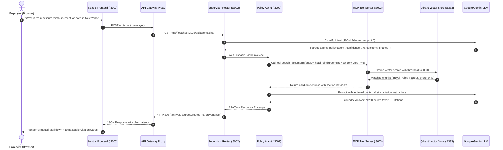

# Enterprise Knowledge AI Assistant — Architecture Specification

## 1. Executive Summary
The **Enterprise Knowledge AI Assistant** is a modular, event-driven multi-agent Retrieval-Augmented Generation (RAG) platform. It provides grounded, hallucination-resistant answers with verifiable source citations across disparate corporate documents (Travel, Remote Work, HR, Finance, IT).

---

## 2. Microservice Topology & Port Mapping

```text
┌──────────────────────────────────────────────────────────────────────────────────┐
│                            CLIENT TIER (PORT 3000)                               │
│  Next.js 14 App Router • Tailwind CSS • Glassmorphism Tokens • Lucide Icons      │
│  - / (Assistant Chat)                                                            │
│  - /documents (Document Explorer & Ingestion Dropzone)                           │
│  - /trace (Multi-Agent Observability DAG Debugger)                               │
└──────────────────────────────────────┬───────────────────────────────────────────┘
                                       │
                                       ▼ (Secure Server-Side Proxy)
┌──────────────────────────────────────────────────────────────────────────────────┐
│                         API GATEWAY / REVERSE PROXY LAYER                        │
│  POST /api/chat     POST /api/documents/upload    GET /api/documents             │
│  GET /api/agents    GET /api/health                                              │
└───────────────────┬──────────────────────────────────────┬───────────────────────┘
                    │                                      │
                    ▼ (Port 3002)                          ▼ (Port 3001)
┌──────────────────────────────────────┐  ┌────────────────────────────────────────┐
│     QUERY & AGENT SERVICE (:3002)    │  │       INGESTION SERVICE (:3001)        │
│  - Supervisor Router Agent           │  │  - Multipart PDF/Text Ingress          │
│  - Policy Agent (Finance/HR/Travel)  │  │  - Semantic Chunker with Overlap       │
│  - Knowledge Agent (Tech/IT/Arch)    │  │  - Vector Embeddings Generation        │
│  - Agent-to-Agent (A2A) Dispatcher   │  │  - Upsert Pipeline                     │
└───────────────────┬──────────────────┘  └───────────────────┬────────────────────┘
                    │                                         │
                    ▼                                         ▼
┌──────────────────────────────────────┐  ┌────────────────────────────────────────┐
│          MCP SERVER (:3003)          │  │       QDRANT VECTOR DATABASE (:6333)   │
│  Model Context Protocol Specification│  │  - Dense Cosine Similarity (1536-dim)  │
│  - search_documents(query, top_k)    │  │  - Payload Metadata Filtering          │
│  - get_document(document_id)         │  │  - Collection: "documents"             │
│  - list_documents()                  │  │                                        │
└───────────────────┬──────────────────┘  └────────────────────────────────────────┘
                    │
                    ▼
┌──────────────────────────────────────┐
│       LLM ENGINE (GOOGLE GEMINI)     │
│  - Multi-Model Cascading Fallback    │
│  - gemini-flash-lite-latest (Pri)    │
│  - gemini-3.5-flash-lite / 3.6-flash │
└──────────────────────────────────────┘
```

---

## 3. Microservice Specifications

| Microservice | Port | Framework / Tech | Core Responsibilities |
|---|:---:|---|---|
| **`services/frontend`** | `3000` | Next.js 14, React 18, Tailwind CSS | Web interface, Markdown rendering, citation badges, upload modal, DAG visualization, reverse proxy. |
| **`services/ingestion`**| `3001` | Express, `pdf-parse`, Google GenAI | Multipart file upload, PDF text extraction, boundary-aware chunking, batch vector embedding, Qdrant upsert. |
| **`services/query`**    | `3002` | Express, Google Gen AI SDK, Zod | Supervisor Router (intent classification), Policy Agent, Knowledge Agent, A2A handoff engine, multi-model fallback. |
| **`services/mcp`**      | `3003` | FastMCP, TypeScript, SSE/Stdio | Model Context Protocol server exposing `search_documents`, `get_document`, and `list_documents`. |
| **Qdrant Vector DB**   | `6333` | Qdrant Engine (Docker) | Vector index, cosine similarity search, payload storage. |
| **n8n Workflow Engine** | `5678` | n8n Community Edition | Visual workflow orchestration, Webhook ingestion, dynamic switch routing. |

---

## 4. End-to-End Execution Flow (Sequence Diagram)



---

## 5. Agent-to-Agent (A2A) Protocol Specification

A2A messages follow a standardized JSON-RPC compliant envelope ensuring full provenance and auditability:

### Request Envelope (`A2ATaskRequest`):
```typescript
{
  "task_id": "5875b8c2-0e98-4289-b15b-37e987e7bcf0",
  "sender_agent": "router-agent",
  "target_agent": "policy-agent",
  "query": "Can you check the travel reimbursement limit for overseas lodging?",
  "context": { "user_session": "sess-402" },
  "delegation_chain": ["router-agent"]
}
```

### Response Envelope (`A2ATaskResponse`):
```typescript
{
  "task_id": "5875b8c2-0e98-4289-b15b-37e987e7bcf0",
  "responding_agent": "policy-agent",
  "query": "Can you check the travel reimbursement limit for overseas lodging?",
  "answer": "The maximum nightly rate allowance for international travel is $280.",
  "sources": [
    {
      "document": "Travel Policy",
      "document_id": "travel-policy",
      "section": "finance",
      "page": 2,
      "score": 0.819
    }
  ],
  "delegated": false,
  "confidence": 0.819,
  "execution_time_ms": 2631,
  "timestamp": "2026-09-17T12:34:49.587Z"
}
```

---

## 6. Multi-Model Resilience & Fallback Engine

To maintain high availability during Free Tier API rate limits and demand spikes, LLM generation utilizes cascading multi-model fallback:

```text
Primary: gemini-flash-lite-latest
   │ (On 429 / 503 / RESOURCE_EXHAUSTED)
   ▼
Fallback 1: gemini-3.5-flash-lite
   │ (On 429 / 503 / RESOURCE_EXHAUSTED)
   ▼
Fallback 2: gemini-3.1-flash-lite
   │ (On 429 / 503 / RESOURCE_EXHAUSTED)
   ▼
Fallback 3: gemini-3.6-flash
```

---

## 7. Security Architecture

1. **API Key Isolation**: `GEMINI_API_KEY` is loaded exclusively into backend service memory via `.env`. No credentials or vector database keys are exposed to the Next.js client browser.
2. **Reverse Proxy Protection**: Client requests access internal microservices only through Next.js server-side Route Handlers.
3. **Input Sanitization**: Query inputs are validated with `zod` schemas before triggering retrieval or inference pipelines.
4. **Hallucination Defense**: System prompts enforce strict groundedness constraints. If a requested topic has no relevant vector chunks, agents explicitly report absence of information rather than fabricating answers.
